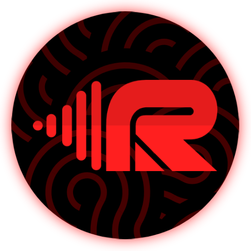

  

<h1 align="center">RingR</h1>

  
  
  
  

  Turn any YouTube video into a custom ringtone right on your phone.

## About

RingR lets you convert YouTube videos into ringtones directly on your device — no server uploads, no file transfers, no accounts. Everything happens locally, so your audio never leaves your phone.

## How It Works

1. **Paste a link** — Copy any YouTube video URL and paste it into RingR.
2. **Pick your clip** — Select the exact portion of the audio you want using the built-in trimmer.
3. **Save as ringtone** — Save your custom clip directly to your device's ringtone collection and set it instantly.

## Features

- **Powered by yt-dlp** — Audio is extracted directly from YouTube using the yt-dlp engine, all on your device.
- **Waveform preview** — Visually see the audio waveform to make precise cuts.
- **Preset durations** — Quick-select 30s, 60s, or 90s clips, or trim manually.
- **Dark & light themes** — Adapts to your system appearance automatically.

## License

MIT
